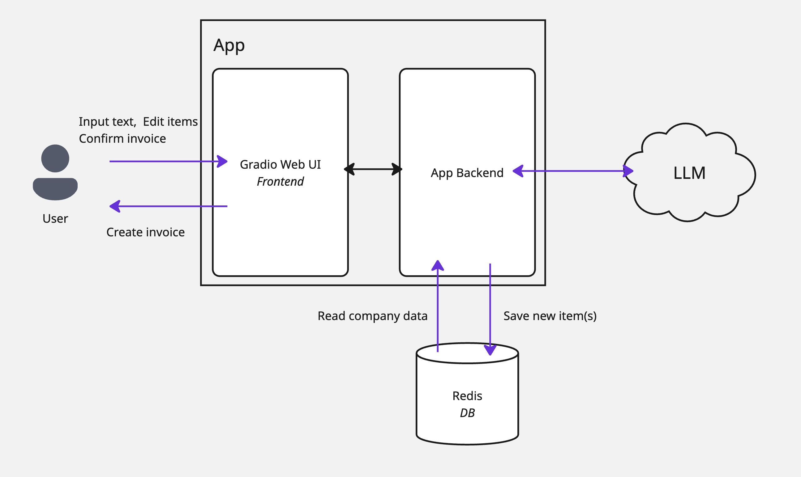
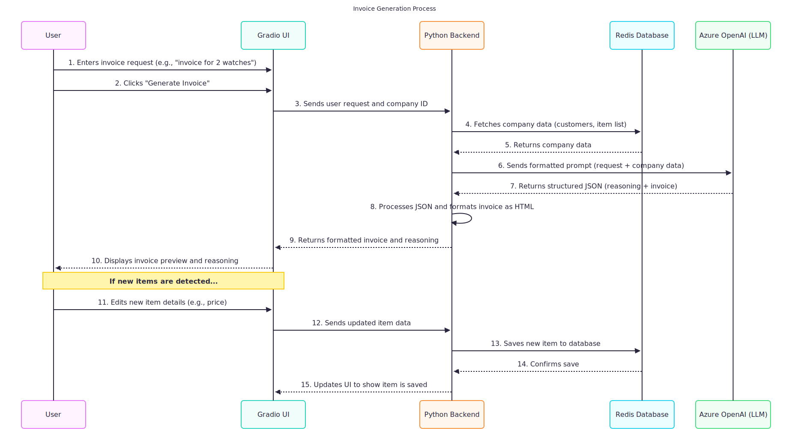
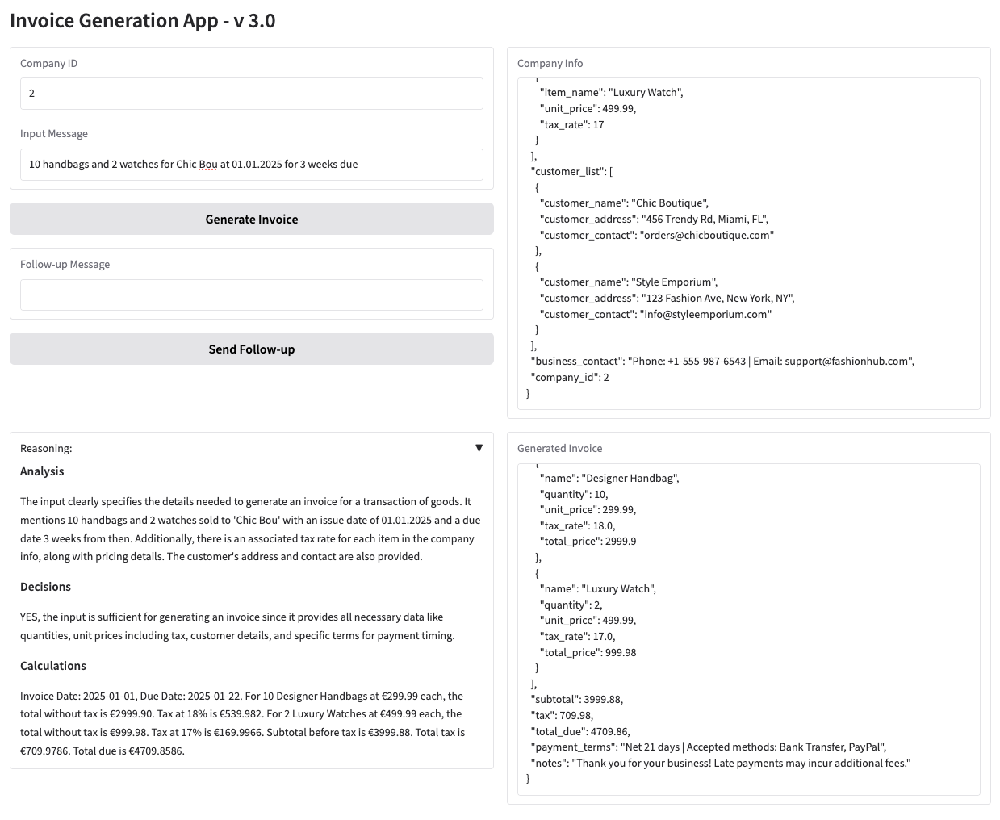

# LLM-powered Invoice Generator

This project is an invoice generator designed to automate and streamline the invoice creation process.
It leverages LLM(currently `GPT-4.1`) to understand user requests in natural language and generate professional, accurate invoices.
The application is built with a user-friendly interface(using `Gradio`) that allows for easy interaction, real-time previews, and management of company data like customers and products.

**Disclaimer:** ALL data are generated by LLM and do not represent any real-world data.

Highlight of the target:
- Simple, clear architecture plus user-friend UI: implemented by Python using rules of thumb libraries.
- Connect LLM to software development programmatically.
- Unlock potential of LLM for automatic data retrieval, item handling, analysis and decision making, data formatting.
- Prompt engineering: few-shot examples, CoT(Chain-of-thought) are explored and implemented to significantly improve the result.

## Architecture



## Sequence Diagram



## Interface



## Installation

### Model provider & API Key (using Azure OpenAI for now)
Put your own secrets in a `.env` file in the root directory of the project. The `.env` file should contain the following:
```
AZURE_API_KEY=YOUR_AZURE_API_KEY
AZURE_ENDPOINT=YOUR_AZURE_ENDPOINT
AZURE_API_VERSION=YOUR_AZURE_API_VERSION
```
More model providers will be supported in the future.

### Development environment
Here I use *uv* to create and maintain a smooth experience.  
You will just need to install the dependencies with the following command:
```shell
uv sync
```

### Spin up the application
To start the application, you can run the following command:
```shell
docker compose up
```

The App will be available at http://0.0.0.0:8002


## TODO list
- [x] Redis import pipeline  
- [x] Customized class to interact with LLM hosted in Azure  
- [x] System prompt to enable reasoning and generate invoice  
- [x] Gradio app interface  
- [x] Structure output  
- [x] Enable sending follow-up messages  
- [ ] Test reasoning model  
- [ ] Enable different LLM support in the config  
- [x] Analyze new items/customers that can be added back to the Redis  
