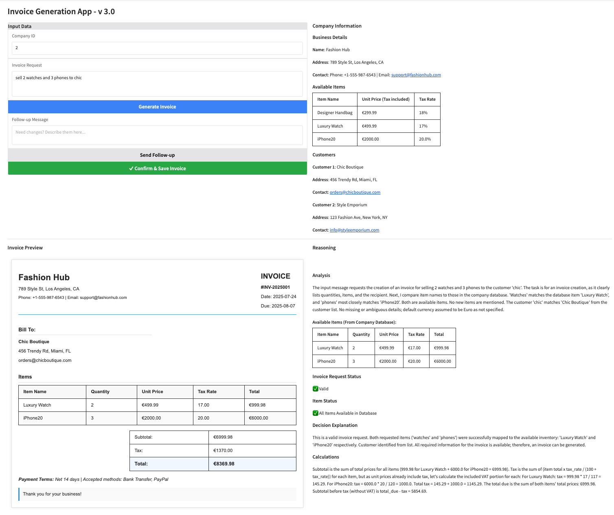

# Invoice Generator back by LLM

This project is a proof of concept for generating professional invoices using LLM. The application takes input data and generates a detailed invoice in JSON format.

**Disclaimer:** ALL data are generated by LLM and do not represent any real-world data.




## Installation

### Model provider & API Key
Put your own secrets in a `.env` file in the root directory of the project. The `.env` file should contain the following:
```
AZURE_API_KEY=YOUR_AZURE_API_KEY
AZURE_ENDPOINT=YOUR_AZURE_ENDPOINT
AZURE_API_VERSION=YOUR_AZURE_API_VERSION
```
More model providers will be supported in the future.

### Development environment
Here I use *pyenv* + *Poetry* to create and maintain a smooth experience.    
You will just need to install the dependencies with the following command:
```shell
poetry install
```

### Spin up the application
To start the application, you can run the following command:
```shell
docker compose up
```

The App will be available at http://0.0.0.0:8002


## TODO list
- [x] Redis import pipeline  
- [x] Customized class to interact with LLM hosted in Azure  
- [x] System prompt to enable reasoning and generate invoice  
- [x] Gradio app interface  
- [x] Structure output  
- [x] Enable sending follow-up messages   
- [ ] Test reasoning model  
- [ ] Enable different LLM support in the config  
- [ ] Analyze new items/customers that can be added back to the Redis  
